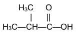
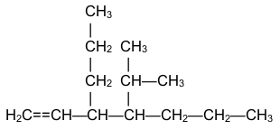
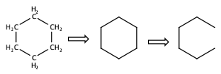
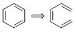
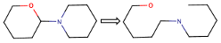
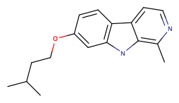
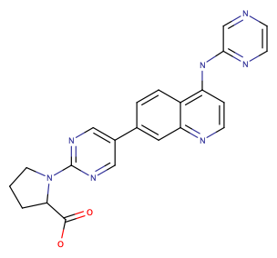

# Prediction of aqueous solubility of novel drug-like compounds

## 1. Overview

The aqueous solubility of a chemical compound is its property to dissolve in water. It reflects the strength of the compound affinity to water. It is an important physico-chemical characteristic because it dictates the compound behavior in an aqueous environment, with immediate applications in medicine or industry.

It is challenging to design drug-like molecules that can efficiently reach their target in an aqueous environment. The hydrophobic active part of anti-cancer drugs needs to be pharmacokinetically compensated by groups with high aqueous solubility. Degenerative diseases, like Alzheimer’s or Parkinson diseases, are suspected to be triggered by abnormal protein-protein aggregations in the aqueous inter-cellular environment. Contrary, disruption of specific protein-protein interactions can generate genetic diseases. It is thus important to control the aqueous interaction of proteins, by disrupting their aggregation or enhancing their specific interactions, respectively.

One mean of durable development involves transition to green chemistry. A way to reach this goal is to reduce the use of organic solvents and enhance the use of water-soluble molecules. One example would be the paint industry, by employing water-soluble polymers. To increase the time-stability of the paint it is necessary to control the degree of solubility of the polymers in the initial stage, before their irreversible entanglement and/or cross-linking. Small compounds can be used as cross-linkers, increasing in this way the domain specificity of the paints.

## 2. Prepare the working environment

This systems were prepared on a macOS machine. The training of the physical descriptors based model was done on the same macOS machine. However, the deep learning SMILESX run was deployed on Google Colab. Detailed instructions on how to set the remote working environment are given at the beginig of each jupyter notebook that run on Google Colab and were downloaded [here](https://github.com/BogdanTarus/solubility/tree/master/models/2_solubility_SMILESX).

## 3. Dataset preparation

### 3.1. Individual compounds and datasets with experimental solubility values

New chemical compounds, with their corresponding experimenal aqueous solubilities, are added to the reference Delaney's dataset. Detailed description of the search procedure and the deposit place can be find [here](https://github.com/BogdanTarus/solubility/tree/master/00_database/2_new_compounds).

### 3.2. Build the molecular SMILES specification

This is a light introduction of SMILES. For an in-depth presentation of the SMILES, please see [here](https://www.daylight.com/dayhtml/doc/theory/theory.smiles.html).

SMILES (Simplified Molecular Input Line Entry System) is a string representation of chemical molecules. It is a language with a simple vocabulary, including atom and bond symbols) and a few grammar rules. 

SMILES notation consists of a series of characters containing no spaces. Hydrogen atoms may be omitted or included. There are encoding rules for atoms, bonds, branches, ring closures, and disconnections.

| Encoding rule | Structure |       Name       | SMILES |
|:-------------:|:---------:|:----------------:|:------:|
|      atom     |     S     | elemental sulfur |   [S]  |
|      atom     |    CH4    |      methane     |    C   |
|      atom     |    H2O    |       water      |    O   |
|     bonds     |   CH3CH3  |      ethane      |   CC   |
|     bonds     |    CO2    |  carbon dioxide  |  O=C=O |

The SMILE representation of a chemical structure is not necessarily unique, especially in the case of linear structures:

|       Encoding rule      |        Structure        |  Valid SMILES |
|:------------------------:|:-----------------------:|:-------------:|
|                          |                         |   C=CCC=CCO   |
| bonds: linear structures | CH2=CH-CH2-CH=CH-CH2-OH | C=C-C-C=C-C-O |
|                          |                         |   OCC=CCC=C   |

Branches are specified by enclosing them in parenthesis:

| Encoding rule |                Structure                |        SMILES        |
|:-------------:|:---------------------------------------:|:--------------------:|
|    branches   |  |      CC(C)C(=O)O     |
|    branches   |  | C=CC(CCC)C(C(C)C)CCC |

Cyclic structures are represented by breaking one bond in each ring:

|               Structure               |      SMILES      |
|:-------------------------------------:|:----------------:|
|  |     C1CCCCC1     |
|  |    C1=CC=CC=C1   |
|  | O1CCCCC1N1CCCCC1 |

These are the structures of two drug candidates and their SMILES mapping:

|              Structure             |                            SMILES                           |
|:----------------------------------:|:-----------------------------------------------------------:|
|  |            CC(C)CCOC1=CC2=C(C=C1)C1=CC=NC(C)=C1N2           |
|  | OC(=O)C1CCCN1C1=NC=C(C=N1)C1=CC2=NC=CC(NC3=NC=CN=C3)=C2C=C1 |

## 4. Construct a web application

A flask API that predicts the aqueous solubility can be deployed on AWS/EC2. The are two forms of the API: a command-line based and a HTML based. The user should input the SMILES of the chemical structure with the unknown aqueous solubility and will get the predicted value. Detailed instructions related to the deployment process can be found [here](https://github.com/BogdanTarus/solubility/tree/master/models/1_solubility_physical-descriptors/03_flask_deployment_AWS-EC2).

## 5. Perspectives

* Make an analysis of the training dataset by inspecting how the physical descriptors are distributed among the compounds. Perform a classification of the compounds within the dataset based on theit size, number of rotatable bonds, and aromaticity proportion. This will give as indication for what kind of compounds we can predict so solubility. 

* Deploy the models as serverless APIs.

* Introduce metrics to the project core evaluation.

* Add new compounds into the datset.
